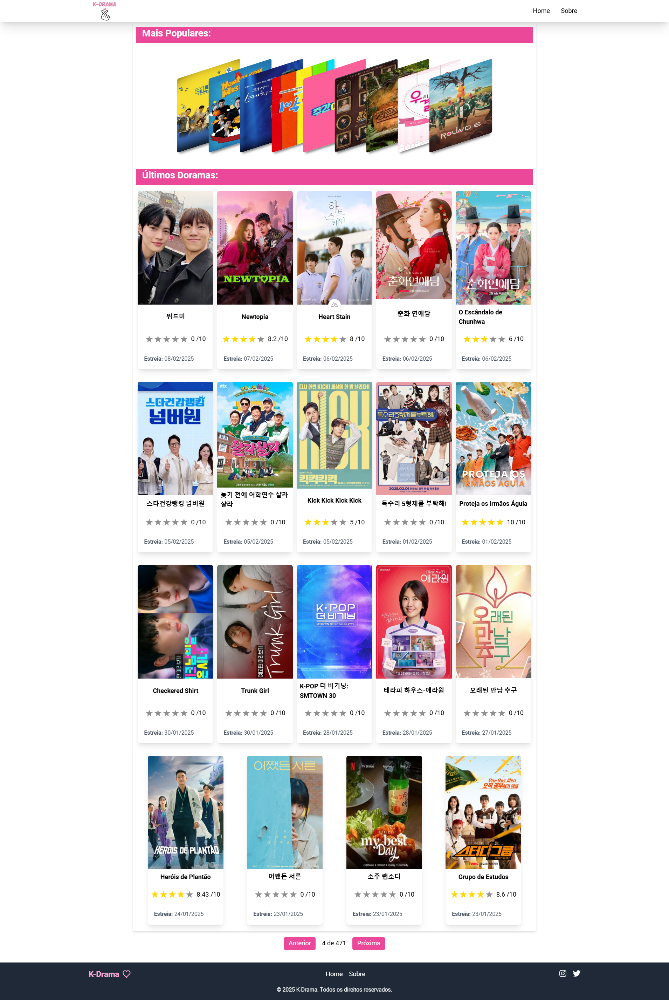
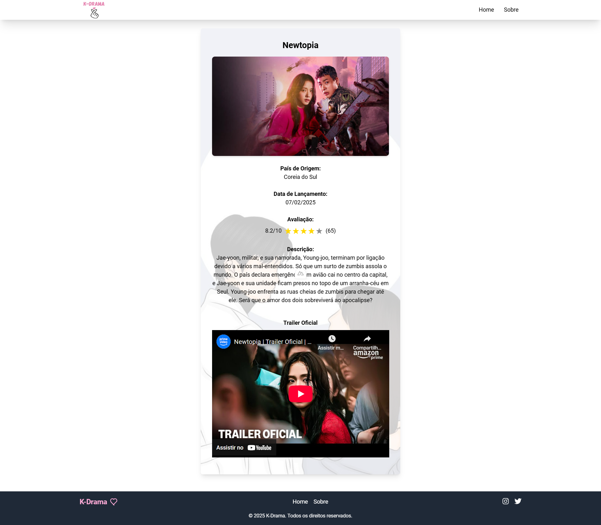
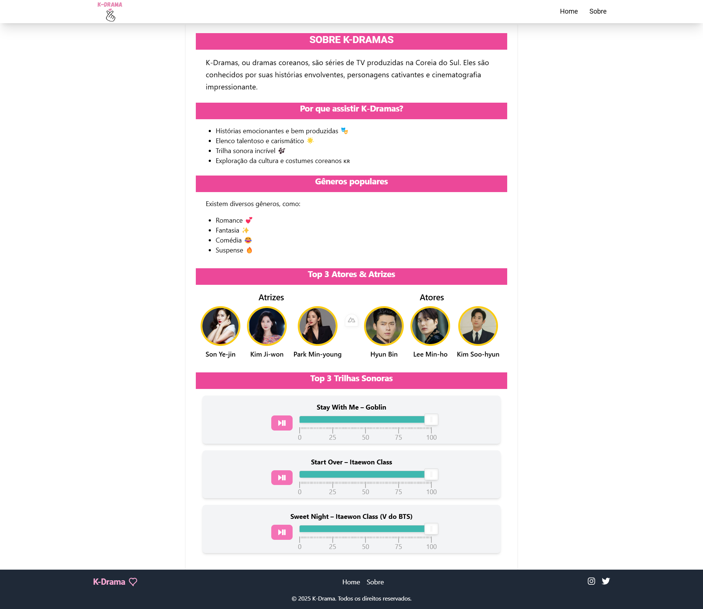
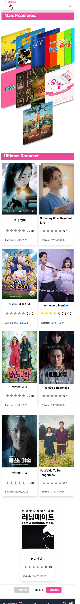
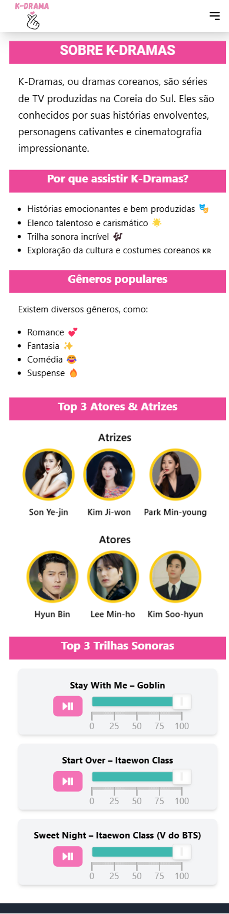

# K-Drama

### 📌 Sobre o Projeto
> O K-Drama é um site que apresenta informações sobre doramas coreanos, incluindo uma página inicial com destaques, uma página de detalhes para cada drama e uma seção "Sobre" que explica mais sobre o universo dos K-Dramas.


#### 🔹 Versão Desktop




#### 🔹 Versão Mobile
<p align="center">
  
  
   
</p>

### 🚀 Funcionalidades

- 🌟 Página Inicial: Destaques e sugestões de doramas populares.
- 📄 Página de Detalhes: Informações detalhadas sobre cada K-Drama.
- ℹ️ Página Sobre: Explicação sobre o mundo dos doramas e seus principais gêneros.
- 🎭 Lista de Atores e Atrizes: Apresentação dos artistas mais famosos.
- 🎶 Trilhas Sonoras: Destaque para músicas marcantes de doramas.

### Requisitos
- **Node.js**: v20.18.0


### 🛠️ Tecnologias Utilizadas

O projeto foi desenvolvido com as seguintes tecnologias:
- **Vue.js 3:**  Framework JavaScript para construção da interface.
- **Nuxt.js:** Framework baseado em Vue.js para SSR e geração de sites estáticos.
- **Tailwind CSS:** Estilização responsiva e moderna.
- **TheMovieDB API:** Fonte de dados sobre K-Dramas.
- **Howler.js:** Gerenciamento de áudio para trilhas sonoras.
- **i18n-iso-countries:** Suporte para nomes de países em diferentes idiomas.
- **NoUiSlider:** Controle deslizante interativo para ajuste de valores.


### 📌 Como Executar o Projeto
 Clone o repositório:

```bash
 git clone https://github.com/Jezebel1990/k-drama-nuxtjs.git
 cd k-drama-nuxtjs
``` 

 Instale as dependências (caso utilize npm ou yarn):
```bash
# npm
npm install  # ou yarn install
``` 
Execute o projeto:
```bash
npm run dev  # ou yarn dev
``` 

### 📜 Licença

Este projeto está licenciado sob a MIT License - veja o arquivo LICENSE para mais detalhes.

Feito com ♥ por [Jezebel Guedes](https://www.linkedin.com/in/jezebel-guedes/) 👋 Entre em contato!